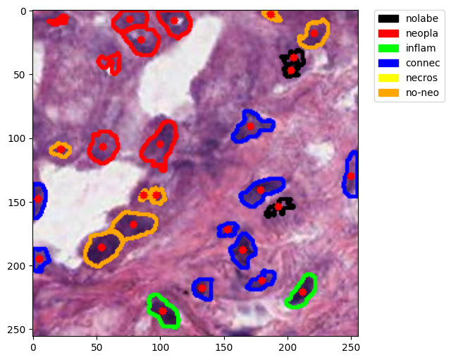

# HoverNet for PanNuke Dataset

This project implements the HoverNet architecture for nuclei instance segmentation and classification using the PanNuke dataset. It provides tools for data preparation, model training, and inference on histopathology images.

## Key Features

* Data preparation pipeline for PanNuke dataset
* Implementation of HoverNet architecture
* Training and inference scripts
* Visualization of results

## Directory Structure

- `docs/`: Documentation files
  - `index.rst`: Main documentation page
  - `install.rst`: Installation instructions
  - `dataset.rst`: PanNuke dataset information
  - `model.rst`: HoverNet model description
  - `training.rst`: Training guide
  - `inference.rst`: Inference guide
- `examples/`: Jupyter notebooks with examples
  - `HoverNet-data.ipynb`: Dataset analysis
  - `HoverNet-train.ipynb`: Training process
  - `inference.ipynb`: Inference example
  - `convert.ipynb`: Data conversion utility
- `tests/`: Test scripts and configurations
  - `visualization/`: Output images from inference tests
  - `test_data_loading.py`: Data loading tests
  - `integration_test_inference.py`: End-to-end inference test

## Installation

See `docs/install.rst` for detailed installation instructions.

## Usage

1. Prepare your data using `examples/HoverNet-data.ipynb`
2. Train the model with `examples/HoverNet-train.ipynb`
3. Run inference using `examples/inference.ipynb`

For more detailed instructions, refer to the documentation in the `docs/` folder.

## Dataset

This project uses the PanNuke dataset. For more information, see `docs/dataset.rst`.

## Model

We implement the HoverNet architecture. Details can be found in `docs/model.rst`.

## Sample Results

Here's an example of a predicted image from our model:

This image shows nuclei segmentation and classification on a histopathology sample.
