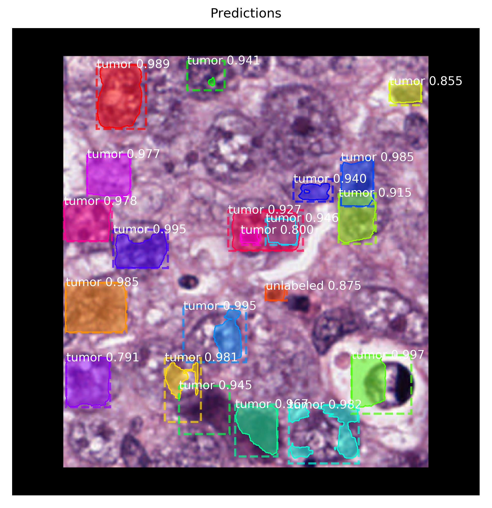

# MaskRCNN for NuCLS Dataset

This project implements the MaskRCNN architecture for nuclei instance segmentation using the NuCLS dataset. It provides tools for data preparation, model training, and inference on histopathology images.

## Key Features

* Data preparation pipeline for NuCLS dataset
* Implementation of MaskRCNN architecture
* Training and inference scripts
* Visualization of results

## Directory Structure

- `docs/`: Documentation files
  - `index.rst`: Main documentation page
  - `install.rst`: Installation instructions
  - `dataset.rst`: NuCLS dataset information
  - `model.rst`: MaskRCNN model description
  - `training.rst`: Training guide
  - `inference.rst`: Inference guide
- `examples/`: Jupyter notebooks with examples
  - `MaskRCNN-data.ipynb`: Dataset analysis
  - `train.ipynb`: Training process
  - `predict.ipynb`: Inference example
- `tests/`: Test scripts and configurations
  - `output_predictions1/`: Output images from inference tests
  - `test.py`: Model prediction tests
  - `evaluate.py`: Model evaluation test

## Installation

See `docs/install.rst` for detailed installation instructions.

## Usage

1. Train the model with `examples/train.ipynb`
2. Run inference using `examples/predict.ipynb`

For more detailed instructions, refer to the documentation in the `docs/` folder.

## Dataset

This project uses the NuCLS dataset. For more information, see `docs/dataset.rst`.

## Model

We implement the MaskRCNN architecture. Details can be found in `docs/model.rst`.

## Sample Results

Here's an example of a Ground_truth image :

This image shows predicted nuclei segmentation.

